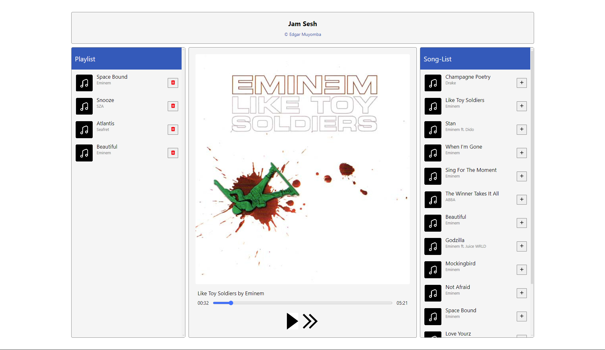

# JamSesh
This is a simple replica of Spotify's jam feature - A feature used by users to listen to the same playlist concurrently on different devices and even different locations. 
This project is made using websockets to ensure real-time communication between the server and the clients. The only feature not available on this project is users having the same real-time progress of a song as if one user pauses his device, the rest of the clients will proceed with the song until the next song is played.

The project is made with python on the backend, html, css and javascript on the frontend and Firebase Storage as the cloud database provider.

## Screenshot

## Events
- Add
  
  Simply used to add a song the playlist from the songs-list. When a client send this, the server broadcasts the changes to all the clients.
- Remove
  
  Similar to the add event but used to remove a song from the playlist.
- Next

  Used to go to the next song in the playlist if any! The changes are again broadcast to all the connected clients.

## Built With
- HTML
- CSS
- JS
- Webpack
- Python
- [Websockets](https://developer.mozilla.org/en-US/docs/Web/API/WebSockets_API#:~:text=The%20WebSocket%20API%20is%20an,the%20server%20for%20a%20reply.)
- [Firebase](https://www.googleadservices.com/pagead/aclk?sa=L&ai=DChcSEwjyi7SQ-Y-IAxVkT0ECHSdRMh0YABAAGgJ3cw&co=1&ase=2&gclid=Cj0KCQjwrKu2BhDkARIsAD7GBotYBlKPZCFmQ6rOTqZEHR_xCr2NCjY2uKcK7rrltIK91KZN_3bHZkcaAjlJEALw_wcB&ohost=www.google.com&cid=CAESV-D24XQrBlHHgxRQg-u9aF5_pDMqM7POVlMIWJYRiF1FbSGgQnk76kY3EOMGrIuXfLLepfjH9qLqz6HILEI7kwR-4vmPWJ4ZlROtaBAIePItyKiSDoZ6aw&sig=AOD64_0PN_ywsaehmQYvqtXfFJTxJS2hig&q&nis=4&adurl&ved=2ahUKEwji5KyQ-Y-IAxUeQvEDHb6dDQ8Q0Qx6BAgIEAE)